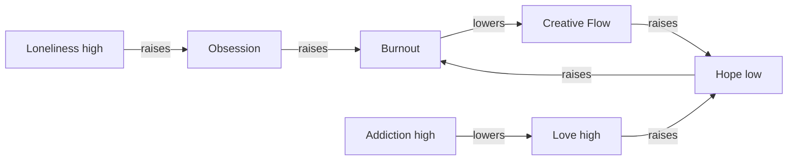

# Emotional simulation graph

The emotional layer is hidden and state-based—not a collection of visible numeric meters. Every node has one of three states: `low`, `steady`, or `high`. An interaction applies one or more directed state shifts, then the relationship graph propagates one step.

Practical consequences are deliberately indirect:

- High Burnout adds a Creativity drain.
- High Addiction adds a Hygiene drain.
- High Loneliness adds a Social drain.
- High Creative Flow partially offsets the Creativity drain.

The graph definitions, graph resolver, and practical consequences are all data-driven in `src/game/simulation/emotionalGraph.ts`. Object action edges live with their object data in `src/data/interactions.ts`.
